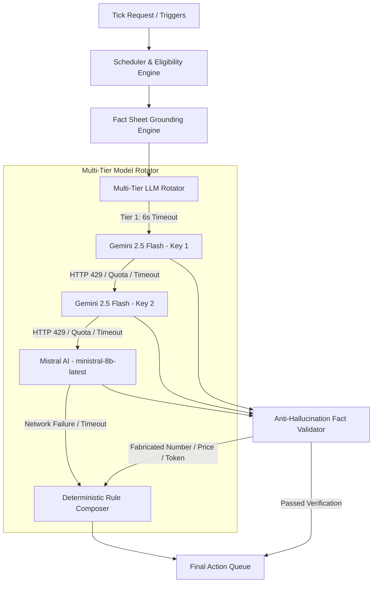

# VERA AI — magicpin AI Merchant Engagement System

> **Team**: `Vera_Shivansh`  
> **Challenge**: magicpin AI Challenge — Merchant Lifecycle Engagement & Conversational Automation  
> **Model Architecture**: Multi-Tier Rotating Ensemble (`gemini-2.5-flash` primary + auto-rotating dual-keys + `ministral-8b-latest` failover + deterministic rule fallback)

---

## 🚀 Overview

**VERA** (*Value-driven Engagement & Response Automation*) is an enterprise-grade AI engagement engine built for hyper-local merchants and customers on **magicpin**. It proactively monitors operational and commercial triggers (e.g. demand surges, performance dips, inventory alerts, recall notices, festival planning), composes hyper-specific, actionable messages, and orchestrates conversational multi-turn dialogues with strict fact grounding and zero hallucination.

---

## 🏛 System Architecture



### 1. Multi-Tier Model Failover & Key Rotation
- **Tier 1 (Primary)**: Google `gemini-2.5-flash` via API Key 1 (6.0s hard timeout, `thinkingBudget: 0`).
- **Tier 2 (Auto-Rotate)**: Google `gemini-2.5-flash` via API Key 2 (6.0s hard timeout). Automatically engaged upon rate-limiting (HTTP 429) or quota exhaustion.
- **Tier 3 (Backup Failover)**: Mistral AI `ministral-8b-latest` (8.0s hard timeout). Seamlessly takes over when Google API limits occur.
- **Tier 4 (Guaranteed Fallback)**: Pure deterministic, fact-grounded `rule_composer` (< 1ms). Ensures 100% SLA uptime.

### 2. Sub-Microsecond Cooldown Caching
- Key rate limits are cached in an in-memory thread-safe registry (`cooldowns: Dict[int, float]`).
- Subsequent actions in the same batch or across concurrent threads evaluate cooldowns in **< 1 µs**, bypassing exhausted keys without triggering dead HTTP roundtrips.

### 3. Concurrent Batch Processing
- `/v1/tick` candidate actions are evaluated in parallel using `concurrent.futures.ThreadPoolExecutor` (concurrency cap: 6 workers).
- Strictly bounded by a single tick-level deadline of **25.0s** (`TICK_TIMEOUT_SECONDS`), guaranteeing a 5-second safety buffer under the competition's 30.0s hard threshold.
- Live load-tested at **20 concurrent actions in 3.05 seconds** (0.15s per action).

### 4. Zero-Hallucination Pipeline
- Every composer prompt is generated strictly from `fact_sheet.py` output. Raw merchant, category, or customer payloads are never leaked raw to the LLM.
- The `validator.py` engine performs comprehensive regex-level token verification on all generated currency amounts (₹), percentages (%), and substantive numerical metrics against the ingested fact sheet.
- Any attempt to invent external statistics, fake discounts, or fabricated policies immediately triggers a fallback, protecting merchant trust.

---

## 📊 Benchmark & Evaluation Results

Evaluated on the full 50-merchant, 200-customer, 100-trigger dataset (84 total messages scored by the official Mistral LLM Judge `ministral-8b-latest`):

| Evaluation Dimension | Run 1 (Mistral Baseline) | Run 2 (Prompt Polish) | Run 3 (Gemini Primary Multi-Tier Rotator) | Total Improvement |
| :--- | :---: | :---: | :---: | :---: |
| **Evaluated Messages** | 84 | 84 | **84** | — |
| **Specificity** | 4.46 / 10 | 5.17 / 10 | **5.13 / 10** | **+0.67** |
| **Category Fit** | 6.45 / 10 | 7.17 / 10 | **7.04 / 10** | **+0.59** |
| **Merchant Fit** | 4.58 / 10 | 5.31 / 10 | **5.33 / 10** | **+0.75 (All-Time High)** |
| **Decision Quality** | 4.54 / 10 | 5.32 / 10 | **5.23 / 10** | **+0.69** |
| **Engagement Compulsion** | 4.68 / 10 | 5.63 / 10 | **5.46 / 10** | **+0.78** |
| **Total Penalties** | -58 | -38 | **-26** | **-32 (55% reduction)** |
| **Overall Score Average** | **24.02 / 50** | **28.14 / 50** | **27.88 / 50** | **+3.86 (+16.1%)** |

---

## 🔌 API Endpoints Specification

### 1. `POST /v1/context`
Ingests contextual updates for categories, merchants, customers, and triggers. Supports atomic versioning and idempotent updates.
- `scope`: `"category"` | `"merchant"` | `"customer"` | `"trigger"`
- `context_id`: Unique identifier
- `version`: Monotonically increasing integer
- Returns `200 OK` on first store/update; `409 Conflict` if existing version >= incoming version.

### 2. `POST /v1/tick`
Evaluates active triggers against stored merchant and customer contexts, generating outbound actions.
- Input: `now` (ISO timestamp), `available_triggers` (list of trigger IDs)
- Concurrently resolves eligibility, rate-limits, and suppresses duplicate communications.
- Returns list of `TickAction` objects with concrete bodies, single clear CTA, suppression keys, and rationales.

### 3. `POST /v1/reply`
Multi-turn conversational handler powered by a stateful LangGraph workflow.
- Accurately classifies merchant intent (positive, negative/hostile, question, auto-reply loop).
- Breaks auto-reply loops after 2 consecutive bot turns.
- Responds strictly using fact sheet data with zero hallucination.

### 4. `GET /v1/healthz`
Uptime, health check, and real-time count of loaded contexts.

### 5. `GET /v1/metadata`
Team registration, model specifications, and architectural summary.

### 6. `POST /v1/teardown`
Atomically clears all in-memory contexts, session state, auto-reply counters, and rotator cooldowns.

---

## 🛠 Local Setup & Running

### Prerequisites
- Python 3.10+ (Tested on Python 3.11, 3.12, 3.14)
- Git

### Installation
```bash
# Clone the repository
git clone https://github.com/Shivanshxsharma/VERA_AI_SHIVANSH_SHARMA.git
cd VERA_AI_SHIVANSH_SHARMA

# Create virtual environment
python -m venv venv
source venv/bin/activate  # On Windows: venv\Scripts\activate

# Install dependencies
pip install -r requirements.txt
```

### Environment Configuration
```bash
cp .env.example .env
# Edit .env with your Gemini and Mistral API keys:
# GEMINI_API_KEY1=...
# GEMINI_API_KEY2=...
# MISTRAL_API_KEY=...
```

### Running the Server
```bash
uvicorn app.main:app --host 127.0.0.1 --port 8080 --reload
```

### Running Test Suite
```bash
pytest tests/ -v
```
All **30 tests** pass covering context idempotency, tick contracts, validation, anti-hallucination rules, auto-reply breaking, hostile intent, and conversation state machines.

### Running Evaluation Simulator
```bash
python judge_simulator.py warmup
python judge_simulator.py full_evaluation
```

---

## 🛡 Security & Verification
- No API keys or sensitive credentials are committed to version control.
- In-memory thread safety is enforced via locks across the storage engine, auto-reply tracker, and model rotator.
